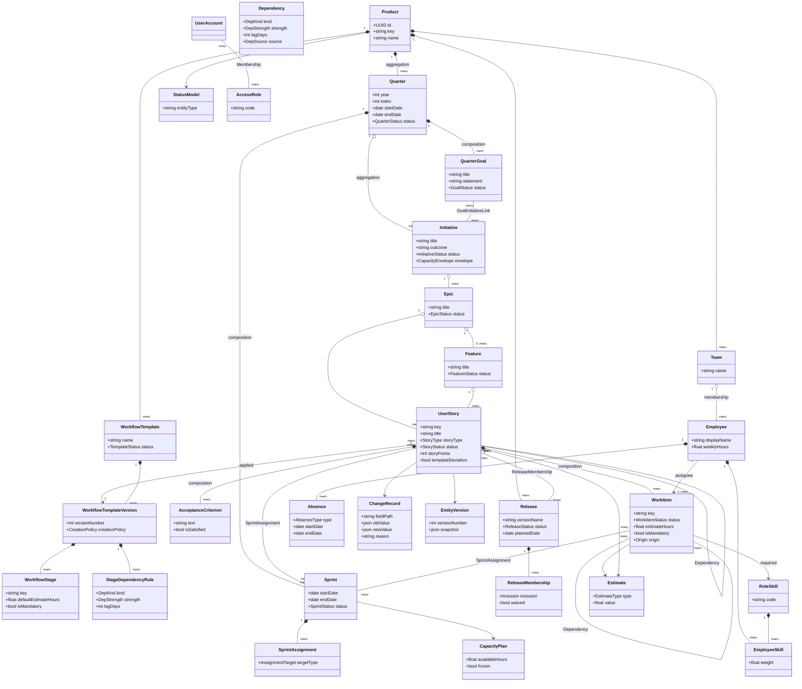
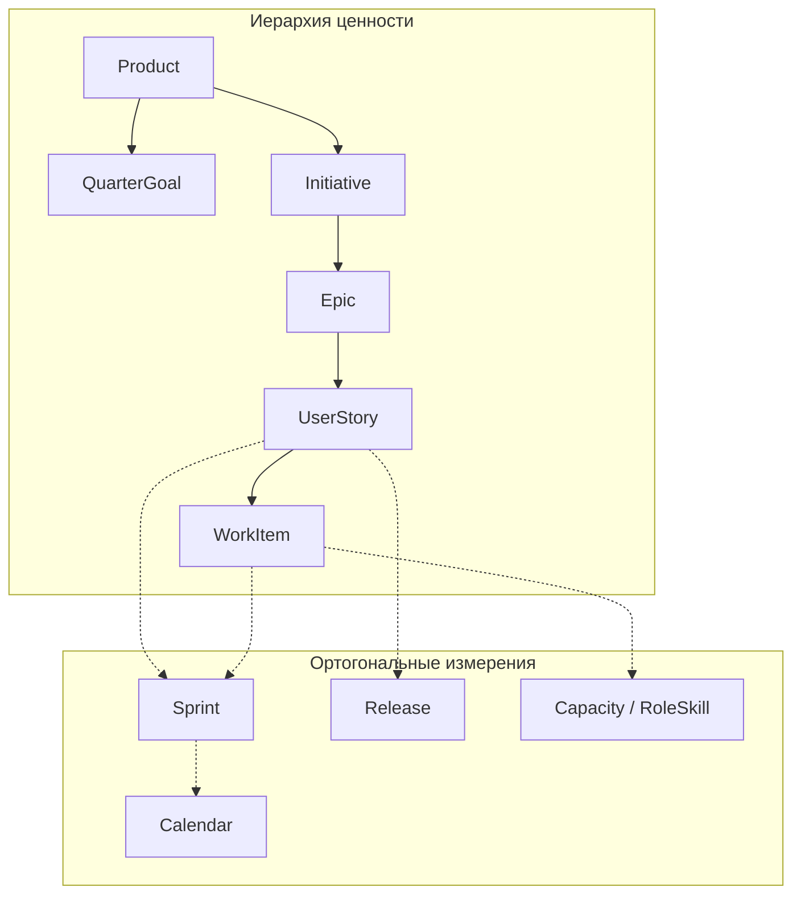

# 05. Связи и UML-модель

## 5.1. Матрица кардинальностей (ключевое)

| From → To | Кардинальность | Вид |
|-----------|----------------|-----|
| Product → Quarter | 1..* | aggregation |
| Product → Team | 1..* | aggregation |
| Product → WorkflowTemplate | 1..* | aggregation |
| Product → Release | 1..* | aggregation |
| Quarter → QuarterGoal | 1..* | composition |
| Quarter → Initiative | 1..* | aggregation |
| Quarter → Sprint | 1..* | composition |
| QuarterGoal ↔ Initiative | *..* | association (GoalInitiativeLink) |
| Initiative → Epic | 1..* | aggregation |
| Epic → Feature | 0..* | aggregation (optional level) |
| Epic/Feature → UserStory | 1..* | aggregation |
| UserStory → WorkItem | 1..* | **composition** |
| UserStory → AcceptanceCriterion | 1..* | **composition** |
| UserStory ↔ Sprint | *..* | association (SprintAssignment) |
| WorkItem ↔ Sprint | *..* | association (SprintAssignment) |
| UserStory ↔ Release | *..* | association (ReleaseMembership) |
| WorkflowTemplate → Version | 1..* | composition |
| Version → WorkflowStage | 1..* | composition |
| Version → StageDependencyRule | 0..* | composition |
| Stage → ChecklistItem | 0..* | composition |
| UserStory → WorkflowTemplateVersion | *..1 | association (applied) |
| Employee ↔ RoleSkill | *..* | association (EmployeeSkill) |
| Employee → Absence | 1..* | composition |
| WorkItem → Employee | *..0..1 | association (assignee) |
| WorkItem → RoleSkill | *..1 | association (required) |
| PlanningObject ↔ PlanningObject | *..* | association (Dependency) |
| Entity → ChangeRecord | 1..* | association/audit |
| Entity → EntityVersion | 1..* | association |
| UserAccount ↔ AccessRole | *..* via Membership | association |

---

## 5.2. Абстрактный контракт PlanningObject

Логическое наследование (не обязательно physical table inheritance):

```
PlanningObject
  ├── Initiative
  ├── Epic
  ├── Feature
  ├── UserStory
  ├── WorkItem
  ├── Milestone
  └── Release (частично — для date gates)
```

Общий контракт: `id`, `productId`, `status`, может быть endpoint Dependency, иметь Estimate, ChangeRecord, Comment.

---

## 5.3. UML Class Diagram (Mermaid)



---

## 5.4. Диаграмма композиции vs ортогональных измерений



---

## 5.5. Правила интерпретации связей

1. **Удаление композитного родителя** → каскадный soft-cancel/archive детей (WorkItems, AC, Stages).
2. **Удаление агрегата** → дети отсоединяются по стратегии (Epic cancel), не удаляются молча.
3. **Ортогональные association** удаляются как link rows (SprintAssignment), объект остаётся.
4. **Dependency** не является parent-child и не заменяет композицию.
